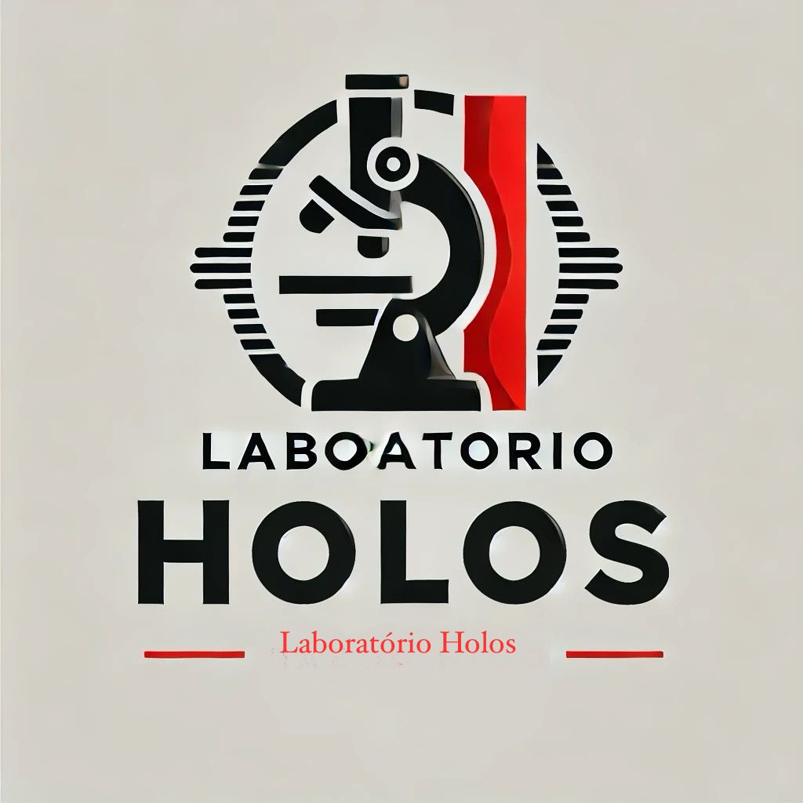

<table>
  <tr>
    <td></td>
    <td><h1>Laboratório Holos - Sistema de Gerenciamento de Exames e Orçamentos</h1></td>
  </tr>
</table>

Sistema web desenvolvido para o Laboratório Holos, com o objetivo de facilitar o gerenciamento de exames, gerar orçamentos em PDF e permitir importação/exportação de dados em CSV. A aplicação é segura, responsiva e baseada em autenticação de usuários.

## Tecnologias Utilizadas

- **Frontend**: HTML, CSS, JavaScript
- **Backend**: Flask (Python)
- **Banco de Dados**: PostgreSQL
- **Containerização**: Docker
- **Bibliotecas**:
  - `SQLAlchemy` para ORM com PostgreSQL
  - `FPDF` para geração de PDFs
  - `bcrypt` para autenticação de usuários

## Funcionalidades

### 1. Autenticação de Usuários
- Login com senha criptografada
- Sessões seguras
- Acesso restrito para usuários autenticados

### 2. Gerenciamento de Exames
- Cadastro, edição e exclusão de exames
- Listagem com filtros de pesquisa
- Armazenamento persistente no banco PostgreSQL

### 3. Geração de Orçamentos em PDF
- Seleção de exames para orçamento
- Documento gerado automaticamente com todos os detalhes

### 4. Importação e Exportação em CSV
- Importa exames a partir de arquivos CSV
- Exporta lista atual de exames para CSV

### 5. Interface Responsiva
- Layout adaptável para desktop, tablets e smartphones

## Execução com Docker

```bash
# Build e execução
docker-compose up --build
